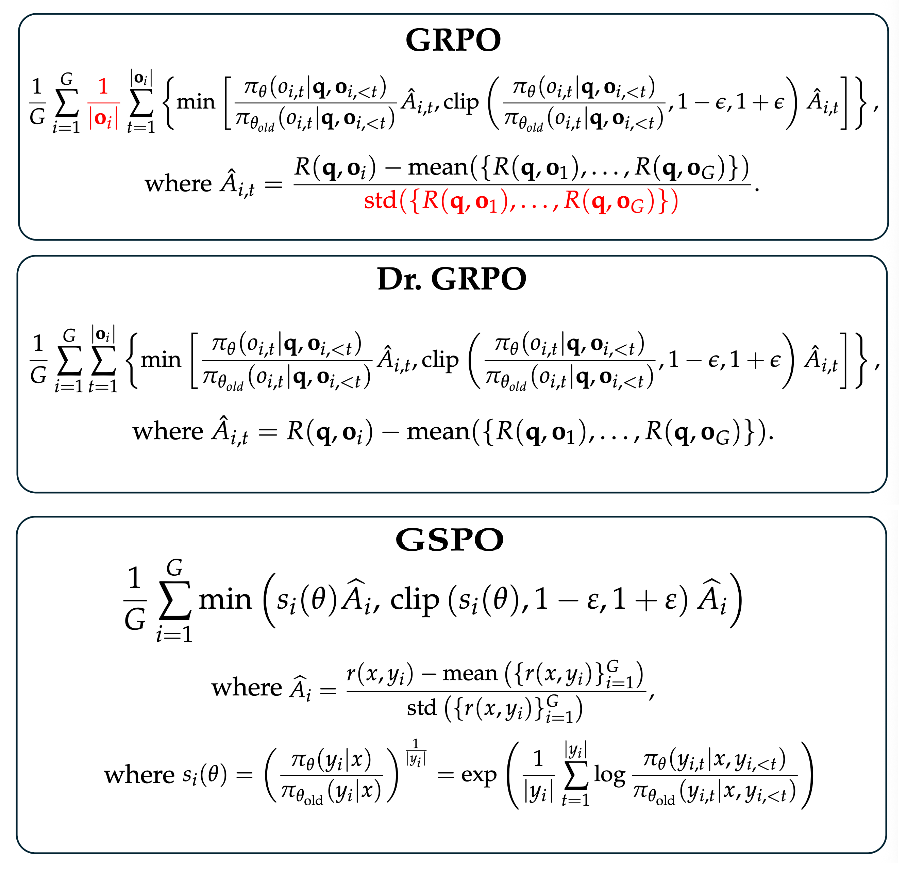

## 写点代码 | 从头编写GRPO、DrGRPO、GSPO，在同样的数据集上训练一样的步数，比较他们的效果

**[English Version of this document](README.en.md)**   
  
在大型语言模型（LLM）的强化学习（RL）领域，一个激动人心的方向是利用可验证的奖励（Verifiable Rewards）进行模型优化，即RLVR。传统的强化学习依赖于人类反馈（RLHF）或者一个专属的价值模型（Value Model），这可能主观又昂贵。而RLVR通过程序化的、客观的奖励函数来指导模型学习，例如，在数学问题上，答案是否正确是可以通过计算验证的。 这种方法为我们提供了一条更高效、可扩展的路径，来增强模型的推理等复杂能力。

在RLVR的核心思想指导下，涌现出了一系列优秀的算法，其中最具代表性的有GRPO、DrGRPO和GSPO。其中是GRPO是训练DeepSeek R1的核心算法，GSPO是训练Qwen 3的核心算法。它们都脱胎于经典的PPO算法，但各自在寻求更高效率和稳定性的道路上做出了不同的探索。 



```bash
%git clone https://github.com/zhangfaen/GRPO_DrGRPO_GSPO_from_scratch_and_benchmark
%cd GRPO_DrGRPO_GSPO_from_scratch_and_benchmark
%conda create -n grpo_drgrpo_gspo python=3.12
%conda activate grpo_drgrpo_gspo 
%pip install -r requirements.txt
%python GRPO_DrGRPO_GSPO_from_scratch_and_benchmark.py
```
### GRPO、DrGRPO、GSPO：一脉相承，各有千秋

要理解这三者，我们首先要明白它们共同的“祖先”——**GRPO（Group Relative Policy Optimization）**。

**GRPO的核心思想**是抛弃PPO中需要额外训练的价值模型（Value Model），从而大幅降低了计算和内存的开销。 它的做法非常巧妙：对于同一个问题（Prompt），让模型生成一组（Group）答案，然后根据奖励函数为每个答案打分。接着，它不再预测一个绝对的“价值”，而是计算每个答案相对于这组答案平均得分的“优势”（Advantage）。如果一个答案的得分高于平均分，它就获得了正优势，模型就会被鼓励学习生成类似答案的策略；反之亦然。 这种“组内相对比较”的思想，就是GRPO名字的由来，它让训练过程变得更加稳定和高效。

然而，有研究者认为GRPO的原始设计存在一些固有的偏见（Bias），它的损失函数计算方式会系统性地“偏袒”那些在错误答案中更长的回复，同时给予那些难度过高或过低的（即所有生成答案都对或都错）问题过大的权重。

为了解决这些问题，**DrGRPO（GRPO Done Right）**应运而生。 它的改进非常直接：**移除导致偏见的操作**。具体来说，DrGRPO去掉了GRPO优势计算中按标准差进行归一化的步骤，以及损失函数中按序列长度进行归一化的部分，从而实现了一个更加公平和无偏的优化目标。

GRPO和DrGRPO虽然高效，但有研究者认为它们都存在一个更深层次的问题：**奖励和优化的粒度不匹配**。 奖励是针对整个生成序列（Sequence）的（例如，最终答案是否正确），但优化却是在每个词元（Token）上进行的。 这种不匹配在高难度任务和更复杂的模型（如混合专家模型，MoE）中，会引入大量噪声，导致训练非常不稳定，甚至模型崩溃。

于是，**GSPO（Group Sequence Policy Optimization）**横空出世，旨在从根本上解决这个问题。 **GSPO的核心是将优化的粒度从词元级别提升到了序列级别**。 它不再为每个词元计算重要性权重，而是为整个序列计算一个统一的权重。 这样一来，优化目标和奖励机制就完全对齐了。 所有的更新操作，包括PPO中的裁剪（Clipping），都是在序列层面上完成的。 这一改动极大地增强了训练的稳定性，尤其是在MoE模型的训练上，避免了GRPO需要的“路由回放（Routing Replay）”等复杂技巧，并显著提升了训练效率和最终性能。

### 代码简介：GRPO_DrGRPO_GSPO_from_scratch_and_benchmark.py

为了让大家能更深入地理解和感受这三种算法的差异，我编写了一个名为`GRPO_DrGRPO_GSPO_from_scratch_and_benchmark.py`的Python脚本。这个文件旨在提供一个清晰、可运行的环境，让你能亲手实践并比较这几种前沿的RL算法。**注：代码以学习和理解为主要目的，实际使用中请根据实际情况进行修改和优化。**

这个脚本主要包含以下几个部分：

1.  **一个统一的训练器 `RLVRTrainer`**：为了公平比较，我将三种算法的通用训练流程封装在一个统一的`RLVRTrainer`类中。它涵盖了模型和分词器的加载、数据处理、日志记录、模型评估以及最终模型的保存等所有必要环节。

2.  **清晰的算法实现**：在`_compute_loss`方法中，你可以通过`loss_type`参数（可选"grpo", "dr_grpo", "gspo"）清晰地看到三种算法在计算损失函数时的核心差异。对于GSPO，还通过`importance_sampling_level`参数区分了其序列级别重要性采样的实现。代码逻辑力求与算法的原始思想保持一致，方便你对照论文进行理解。

3.  **标准化的实验设置**：脚本使用公开的`openai/gsm8k`数据集进行数学推理任务的训练和评测。在`main`函数中，你可以看到一个标准化的实验流程：
    *   **加载和准备数据**：一次性加载数据集，并划分为训练集和评估集。
    *   **统一起始点**：所有算法都从同一个预训练模型（`Qwen/Qwen2.5-1.5B-Instruct`）开始训练，并进行初始性能评估，确保比较的起点公平。
    *   **相同的训练资源**：所有算法都使用相同的超参数（如学习率、批次大小等）和训练步数（`num_steps`）进行训练。
    *   **端到端的比较**：脚本会自动依次运行GSPO、GRPO和DrGRPO的训练和评估流程，并在最后打印出清晰的性能对比结果，包括初始准确率、最终准确率以及提升幅度。

通过阅读和运行这个脚本，我们不仅可以加深对GRPO、DrGRPO和GSPO核心思想的理解，还能直观地看到“序列级别优化”相比“词元级别优化”所带来的显著优势。希望这段代码能帮你更好理解大模型强化学习。

### 我运行上述脚本的一个的结果
在一张A800 GPU卡上，运行上述脚本，大约花费5个小时左右，产生如下结果。
<div align="center">

| 方法     | 初始准确率 | 最终准确率 | 提升幅度 (Δ) |
|----------|------------|------------|--------------|
| GSPO    | 12.00%     | 72.00%     | 60.00%       |
| GRPO    | 12.00%     | 72.00%     | 60.00%       |
| DrGRPO  | 12.00%     | 58.00%     | 46.00%       |

</div>

可以看到，没有经过强化训练的Qwen/Qwen2.5-1.5B-Instruct，在数学推理任务中（基于openai/gsm8k数据集评测），准确率约为12.00%。经过GSPO和GRPO算法的强化训练，准确率分别提升至72.00%和72.00%，而经过DrGRPO算法的强化训练，则提升至58.00%。GSPO和GRPO的提升幅度为60.00%和60.00%，而DrGRPO的提升幅度为46.00%。需要说明的是，这次运行使用的数据集openai/gsm8k是小学水平的数学应用题，数据集规模小，推理难度较低，训练过程只训练了200步，结果参考就好，不代表DrGRPO在大规模生产环境中比GRPO和GSPO差。

### Appendix
---
- [GSPO Paper](https://arxiv.org/abs/2507.18071)
- [GRPO Paper](https://arxiv.org/abs/2402.03300)
- [Dr.GRPO Paper](https://arxiv.org/pdf/2503.20783)